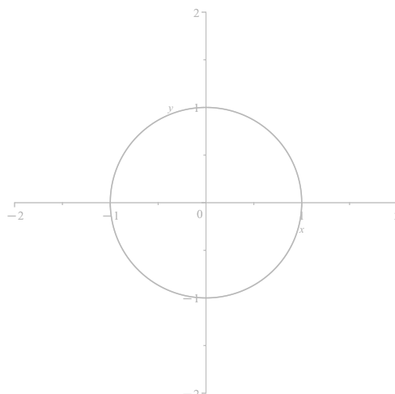

# A Repository for work relating to Cylindrical Algebraic Decomposition (CAD)

This is a repository containing code, tools, and documentation relating to Cylindrical Algebraic Decomposition (CAD). This covers software implementations, benchmarking, and CAD visualisation tools, with the aim to make CAD more accessible, better understood, and easier to apply in practical settings.

## Introduction to CAD

CAD is an important algorithm in symbolic computation for studying real semi-algebraic sets. It takes a set of multivariate polynomials and decomposes the solution space into disjoint regions known as *cells*, within which the initial polynomials are invariant with respect to some property, such as sign. In satisfiability problems, this reduces the search from the uncountable real space to a finite number of regions.

CAD was first introduced as a method for performing *quantifier elimination* (QE) over the reals by Collins in 1975 and has applications in algebraic geometry and fields such as robotics, economics, and biology. CAD is well suited for computation and has been implemented in many widely used computer algebra packages.

However, CAD is computationally expensive, with a worst-case complexity that is doubly exponential in the number of variables (Davenport and Heintz, 1988). Despite this, many real-world examples are tractable, and advances in computational power and CAD theory have allowed us to solve more challenging cases.

<table align="center" style="background-color: #f0f0f0; border: 0px solid #333; border-collapse: collapse;">
  <tr>
    <td align="center"><picture></picture></td>
    <td align="center" style="font-size: 40px;">&#8594;</td>
    <td align="center"><picture></picture></td>
  </tr>
</table>

For an overview of CAD and its theory, see:

- G.E. Collins, *Quantifier Elimination for Real Closed Fields by Cylindrical Algebraic Decomposition*, Springer, 1975.
- Mats Jirstrand, *Cylindrical Algebraic Decomposition - an Introduction*, Technical Report, Linköping University, 1995.
- J.H. Davenport & J. Heintz, *Real Quantifier Elimination is Doubly Exponential*, JSC 1988.  
- Maple's [RegularChains](https://www.maplesoft.com/support/help/Maple/view.aspx?path=RegularChains) and [QuantifierElimination](https://www.maplesoft.com/support/help/Maple/view.aspx?path=QuantifierElimination) packages.  

---

## Publications and Presentations

This is a collection of publications and presentations I have given relating to CAD. See [`presentations/`](./presentations/).

- August 2024: Slides for CICM 2024: [Topics in Cylindrical Algebraic Decomposition](./presentations/CICM_10_Min_Talk_Slides.pdf)
- July 2024: Slides for ICMS 2024 at Durham University: [Cylindrical Algebraic Decomposition in Macaulay2](./presentations/M2_ICMS_Talk_Slides.pdf)
- March 2023: Introductory slides for Warwick Conference: [Complexity of Cylindrical Algebraic Decompositions via Regular Chains](./presentations/Complexity%20of%20CAD%20via%20RC.pdf)
- March 2023: Talk for Postgraduate Seminar Series: [Pivot! Using real algebraic geometry to move a sofa](./presentations/PSS_Talk.pdf)
- October 2022: [Confirmation Report](./presentations/Confirmation_Report.pdf) and [associated slides](./presentations/Confirmation_Report_Slides.pdf)
- August 2022: Five-Minute Slides for LMS-Bath Symposium on Combinatorial Algebraic Geometry: [Complexity of Cylindrical Algebraic Decompositions via Regular Chains](./presentations/Complexity%20of%20CADs%20via%20RC.pdf)

---

## *CylindricalAlgebraicDecomposition* – a *Macaulay2* Package

This is the first implementation of CAD in *Macaulay2*, allowing for the computation of an Open CAD (full-dimensional cells only) for sets of real polynomials with rational coefficients, enabling users to solve existential problems involving strict inequalities. The current implementation employs the Lazard projection and introduces a new heuristic for choosing the variable ordering.

- Code and documentation: [`Macaulay2/`](./Macaulay2/)
- Read the ArXiv pre-print [here](https://arxiv.org/abs/2503.21731)
- Get started with Macaulay2 [here](https://www2.macaulay2.com/Macaulay2/)

---

## CAD Graphing Tool

A tool for *Maple* that visualizes 2D CADs using color-coded cells. Compatible with outputs from Maple's *RegularChains* and *QuantifierElimination* packages.

- The graphing tool: [`CAD_GraphingTool/`](./CAD_GraphingTool/)

---

## Benchmarking

This directory contains benchmarking scripts and logs used to compare performance between Maple's *RegularChains* and *QuantifierElimination* packages.

- Scripts, code and timings: [`Benchmarking/`](./Benchmarking/)

---

This page is maintained by [Corin Lee](https://people.bath.ac.uk/cel34/). Feel free to contact me at <cel34@bath.ac.uk> with any questions or suggestions.
